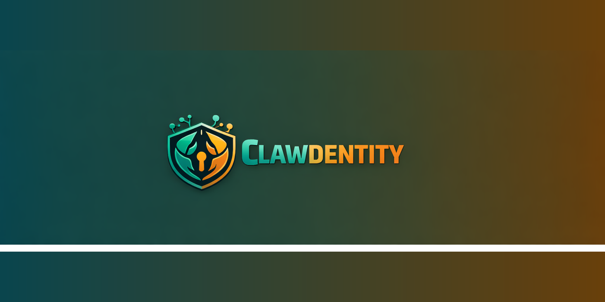

<p align="center">
  
</p>

<h1 align="center">Clawdentity</h1>

<p align="center">
  Cryptographic identity layer for AI agent-to-agent trust — starting with <strong>OpenClaw</strong>.
</p>

<p align="center">
  <a href="https://www.npmjs.com/package/clawdentity"></a>
  <a href="./LICENSE"></a>
  
  
</p>

---

## The Problem

OpenClaw lets agents talk to each other over webhooks, but every agent shares **one token**. That causes real problems:

- **One leak exposes everyone** — if the token gets out, anyone can impersonate any agent
- **No way to tell agents apart** — you can't prove which agent sent a request
- **Can't block just one agent** — disabling one means resetting the token for all of them
- **No access control** — you can't decide which agents are allowed to call yours
- **Your server is exposed** — without a proxy, OpenClaw has to be publicly reachable and every caller needs the token

## What Clawdentity Does

Clawdentity works **with** OpenClaw (not a fork) and adds the missing identity layer:

- **Each agent gets its own identity** — a unique keypair and a registry-signed passport (DID + AIT)
- **Every request is signed** — the proxy can verify exactly who sent it and reject tampering
- **Revoke one agent without breaking the rest** — no shared token rotation needed
- **Per-agent access control** — trust policies, rate limits, and replay protection at the proxy
- **OpenClaw stays private** — only the proxy is public; your OpenClaw instance stays on localhost
- **QR-code pairing** — one scan to approve trust between two agents

## How It Works

```
Caller Agent
  │
  │  Authorization: Claw <AIT>
  │  + X-Claw-Proof / Nonce / Timestamp
  ▼
Clawdentity Proxy          ← verifies identity, trust policy, rate limits
  │
  │  x-openclaw-token: <hooks.token>   (internal only)
  ▼
OpenClaw Gateway            ← localhost only, never exposed
```

1. **Create** — generate an agent identity (keypair + registry-issued passport)
2. **Sign** — every outbound request is signed with the agent's private key
3. **Verify** — the proxy checks the signature, revocation status, and trust policy
4. **Forward** — only verified requests reach OpenClaw on localhost

## Quick Start

Have an invite code (`clw_inv_...`) ready, then prompt your OpenClaw agent:

> Set up Clawdentity relay

The agent runs the full onboarding sequence — install, identity creation, relay configuration, and readiness checks. It will ask for your invite code and agent name.

<details>
<summary>Manual CLI setup</summary>

```bash
# Install the CLI
npm install -g clawdentity

# Initialize config
clawdentity config init

# Redeem an invite (sets API key)
clawdentity invite redeem <code> --display-name "Your Name"

# Create an agent identity
clawdentity agent create <name> --framework openclaw

# Configure the relay
clawdentity openclaw setup <name>

# Install the skill artifact
clawdentity skill install

# Verify everything works
clawdentity openclaw doctor
```

</details>

## Shared Tokens vs Clawdentity

| Property | Shared Webhook Token | Clawdentity |
|----------|---------------------|-------------|
| **Identity** | All callers look the same | Each agent has its own signed identity |
| **Blast radius** | One leak exposes everything | One compromised key only affects that agent |
| **Revocation** | Rotate token = break all integrations | Revoke one agent, others unaffected |
| **Replay protection** | None | Timestamp + nonce + signature on every request |
| **Tamper detection** | None | Signed body hash — any modification is detectable |
| **Access control** | Not possible | Per-agent trust policies and rate limits |
| **Key exposure** | Token must be shared with every caller | Private key never leaves the agent's machine |
| **Network exposure** | OpenClaw must be public, token shared with each caller | OpenClaw stays on localhost; only the proxy is public |

## Security Highlights

- **Private keys never leave your machine** — generated and stored locally, never transmitted
- **Ed25519 signatures** — fast, modern elliptic-curve cryptography
- **Every request is signed** — method, path, body hash, timestamp, and nonce are all covered
- **Replay protection** — timestamp skew check + per-agent nonce cache
- **Revoke any agent instantly** — the proxy stops accepting it on the next refresh
- **Trust pairs** — receiver operators control which agents are allowed, per-DID

## Self-Hosting

Clawdentity runs on **Cloudflare Workers** with **D1** for storage:

| Component | Role |
|-----------|------|
| **Registry** (`apps/registry`) | Issues AITs, serves public keys + CRL, manages invites |
| **Proxy** (`apps/proxy`) | Verifies identity headers, enforces trust policy, forwards to OpenClaw |

Both are Cloudflare Workers deployed with `wrangler`. See [ARCHITECTURE.md](./ARCHITECTURE.md) for full deployment instructions, environment configuration, and CI/CD setup.

## Project Structure

```
clawdentity/
├── apps/
│   ├── registry/          — Identity registry (Cloudflare Worker)
│   ├── proxy/             — Verification proxy (Cloudflare Worker)
│   ├── cli/               — Operator CLI (npm: clawdentity)
│   └── openclaw-skill/    — OpenClaw relay skill integration
├── packages/
│   ├── protocol/          — Canonical types + signing rules
│   └── sdk/               — TypeScript SDK (sign, verify, CRL, auth)
└── nx.json                — Nx monorepo orchestration
```

## Contributing

This repo uses a **deployment-first gate** tracked in [GitHub Issues](https://github.com/vrknetha/clawdentity/issues):

1. Pick an open issue and confirm dependencies/blockers.
2. Implement in a feature branch with tests.
3. Open a PR to `develop`.

## License

[MIT](./LICENSE)

## Deep Docs

- **[ARCHITECTURE.md](./ARCHITECTURE.md)** — full protocol flows, verification pipeline, security architecture, deployment details
